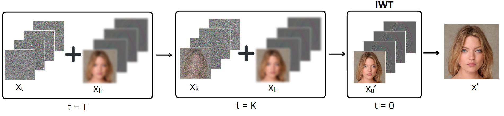

##### Table of contents
1. [Installation](#installation)
2. [Dataset preparation](#dataset-preparation)
3. [How to run](#how-to-run)
4. [Results](#results)
5. [Evaluation](#evaluation)
6. [Acknowledgments](#acknowledgments)

This study introduces a wavelet-based conditional diffusion scheme to address speed limitations in Image Super-Resolution Diffusion Models. Utilizing discrete wavelet transform on both image and feature levels, it efficiently reduces training and inference times while maintaining high-fidelity output. The study focuses on Single-Image Super-Resolution, demonstrating effectiveness through experimental validation on CelebA-HQ. This approach offers a practical solution for real-time implementation, contributing to the development of efficient diffusion models in image super-resolution.

<p align="center">
  
</p>


## Installation ##
Python `3.10.12` and Pytorch `1.11.0` are used in this implementation.

You can install neccessary libraries as follows:
```bash
pip install -r requirements.txt
```

## Dataset preparation ##
We trained on CelebA HQ (16x16 -> 128x128). 

If you don't have the data, you can prepare it in the following way:

Download [CelebaHQ 256x256](https://www.kaggle.com/datasets/badasstechie/celebahq-resized-256x256).

Use the following script to prepare the dataset in PNG or LMDB format:
```
# Resize to get 16×16 LR_IMGS and 128×128 HR_IMGS, then prepare 128×128 Fake SR_IMGS by bicubic interpolation
# Specify -l for LMDB format
python datasets_prep/prepare_data.py  --path [dataset root]  --out [output root] --size 16,128 -l
```


Once a dataset is downloaded and prepared, please put it in `data/` directory as follows:
```
data/
├── celebahq_16_128
```

## How to run ##
We provide a bash script for our experiments. The syntax is following:
```
bash run.sh <DATASET> <MODE> <#GPUS>
```
where: 
- `<DATASET>`: `celebahq_16_128`.
- `<MODE>`: `train` and `test`.
- `<#GPUS>`: the number of gpus (e.g. 1, 2, 4, 8).

Note, please set argument `--exp` correspondingly for both `train` and `test` mode. All of detailed configurations are well set in [run.sh](./run.sh). 

**GPU allocation**: Our work is experimented on a single NVIDIA Tesla T4 GPU 15GBs.

## Results ##
Comparisons between our model and SR3 (both trained on 25k iteration steps) are below:
<table>
  <tr>
    <th>Metric</th>
    <th>Ours</th>
    <th>SR3</th>
  </tr>
  <tr>
    <td>PSNR (↑)</td>
    <td><b>23.53</b></td>
    <td>14.65</td>
  </tr>
  <tr>
    <td>SSIM (↑)</td>
    <td><b>0.69</b></td>
    <td>0.42</td>
  </tr>
  <tr>
    <td>FID (↓)</td>
    <td><b>48.3</b></td>
    <td>99.4</td>
  </tr>
  <tr>
    <td>Inference time (↓)</td>
    <td><b>0.12s</b></td>
    <td>60.3s</td>
  </tr>
</table>

Inference time is computed over 300 trials on a single NVIDIA Tesla T4 GPU for a batch size of 64.

Downloaded pre-trained models should be put in `saved_info/wdd_gan/<DATASET>/<EXP>` directory where `<DATASET>` is defined in [How to run](#how-to-run) section and `<EXP>` corresponds to the folder name of pre-trained checkpoints.

## Evaluation ##
### Inference ###
Samples can be generated by calling [run.sh](./run.sh) with `test` mode.

### FID ###
To compute fid of pretrained models at a specific epoch, we can add additional arguments including ```--compute_fid``` and ```--real_img_dir /path/to/real/images``` of the corresponding experiments in [run.sh](./run.sh).

### PSNR and SSIM ###
A simple script is provided to compute PSNR and SSIM for the results. Please notice that you have to run inference without the ```--compute_fid``` and ```--measure_time``` options before executing the script.
```
python /benchmark/eval.py -p [result root]
```

## Acknowledgments
WaveDiff [implementation](https://github.com/VinAIResearch/WaveDiff) and [paper](https://arxiv.org/abs/2211.16152);

SR3 [unofficial implementation](https://github.com/Janspiry/Image-Super-Resolution-via-Iterative-Refinement/tree/master) and [paper](https://arxiv.org/abs/2104.07636);

Wavelet transforms [implementation](https://github.com/LiQiufu/WaveCNet).
