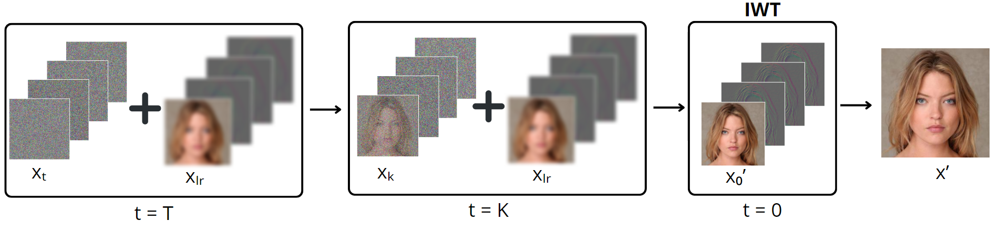
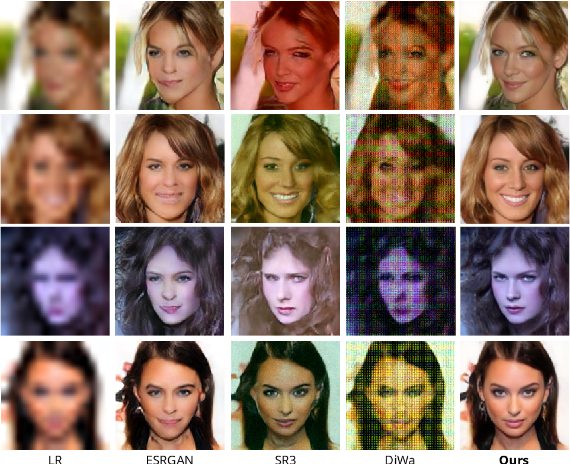

<h2 align="center"> 
<a href="http://arxiv.org/abs/2410.17966">
[WIRN 2024] A Wavelet Diffusion GAN for Image Super-Resolution
</a>
</h2>

<div align=center></div>

<h5 align="center"> If you find this project useful, consider giving it a star ⭐ </h5>

<h5 align="center">

[](http://arxiv.org/abs/2410.17966)
[]([https://www.siren-neural-net.it/wirn-2024/](https://link.springer.com/chapter/10.1007/978-981-95-4072-3_36))


</h5>

---

## 📰 News
* **[2026]** [Conference Proceeding available](https://link.springer.com/chapter/10.1007/978-981-95-4072-3_36) 🎉  
* **[2024]** Paper accepted at WIRN 2024 🎉  
* **[2024]** Code and experiments released  
* **[2024]** Presentation available [here](https://docs.google.com/presentation/d/1uPNolm151zBjX64I6trNkYqEn0kgDeSPXAZwFGm5vxU/edit?usp=sharing)

---

## 😮 Highlights

### ⚡ Fast Diffusion for Super-Resolution
We propose a **Diffusion GAN framework** that significantly reduces the number of diffusion steps, making diffusion-based super-resolution much faster and more practical.

### 🌊 Wavelet-Based Representation
By leveraging the **Discrete Wavelet Transform (DWT)**, the model operates in a compressed frequency domain, reducing computational cost while preserving fine details.

### 🖼️ High-Fidelity Image Reconstruction
Our method achieves superior perceptual quality and reconstruction fidelity, outperforming strong baselines such as **SR3**, **DiWa**, and **ESRGAN**.

---

## 🚀 Main Results

<div align=center></div>

### Quantitative Comparison

| Metric | ESRGAN | SR3 | DiWa | **Ours** |
|--------|--------|-----|------|---------|
| PSNR ↑ | 21.13 | 14.65 | 13.68 | **23.38** |
| SSIM ↑ | 0.59 | 0.42 | 0.13 | **0.68** |
| LPIPS ↓ | 0.082 | 0.365 | 0.336 | **0.061** |
| FID ↓ | **20.8** | 99.4 | 270 | 47.2 |

---

### ⏱️ Efficiency Comparison

| Model | Runtime | Parameters |
|------|--------|-----------|
| ESRGAN | 0.04s | 31M |
| SR3 | 60.3s | 98M |
| DiWa | 34.7s | 92M |
| **Ours** | 0.12s | 57M |

---

## 🛠️ Installation

```bash
conda create --name=wadigan python=3.10
conda activate wadigan

pip install -r requirements.txt
````

---

## 📂 Dataset Preparation

We train on **CelebA-HQ (16×16 → 128×128)**.

Download dataset:

* [https://www.kaggle.com/datasets/badasstechie/celebahq-resized-256x256](https://www.kaggle.com/datasets/badasstechie/celebahq-resized-256x256)

Prepare dataset:

```bash
python datasets_prep/prepare_data.py \
  --path [dataset root] \
  --out [output root] \
  --size 16,128 -l
```

⚠️ Important:

* Images must be **sequentially numbered** for LMDB conversion.

Structure:

```
data/
└── celebahq_16_128
```

---

## ▶️ How to Run

We provide a unified script:

```bash
bash run.sh <DATASET> <MODE> <#GPUS>
```

Example:

```bash
bash run.sh celebahq_16_128 train 1
```

### Arguments:

* `<DATASET>`: `celebahq_16_128`
* `<MODE>`: `train` / `test`
* `<#GPUS>`: number of GPUs

⚠️ Use the same `--exp` name for training and testing.

---

## 🧪 Evaluation

Metrics are computed on the full test set (6000 samples).

### Generate Samples

```bash
bash run.sh celebahq_16_128 test 1
```

### FID

Add:

```bash
--compute_fid --real_img_dir /path/to/real/images
```

### PSNR / SSIM / LPIPS

```bash
python benchmark/eval.py -p [result root]
```

---

## 📦 Pretrained Models

Place checkpoints in:

```
saved_info/srwavediff/<DATASET>/<EXP>
```

---

## 📖 Method Overview

Our framework combines:

* Diffusion models (reduced timesteps)
* GAN training paradigm
* Wavelet-domain processing

This enables:

* Faster inference
* Lower memory usage
* Improved texture reconstruction

---

## 📚 Acknowledgements

* WaveDiff: [https://github.com/VinAIResearch/WaveDiff](https://github.com/VinAIResearch/WaveDiff)
* SR3: [https://github.com/Janspiry/Image-Super-Resolution-via-Iterative-Refinement](https://github.com/Janspiry/Image-Super-Resolution-via-Iterative-Refinement)
* DiWa: [https://github.com/Brian-Moser/diwa](https://github.com/Brian-Moser/diwa)
* ESRGAN: [https://arxiv.org/abs/1809.00219](https://arxiv.org/abs/1809.00219)
* BasicSR: [https://github.com/XPixelGroup/BasicSR](https://github.com/XPixelGroup/BasicSR)
* pytorch_wavelets: [https://github.com/fbcotter/pytorch_wavelets](https://github.com/fbcotter/pytorch_wavelets)

---

## 📌 Citation

```bibtex
@Inbook{aloisi2026wavelet,
author="Aloisi, Lorenzo
and Sigillo, Luigi
and Uncini, Aurelio
and Comminiello, Danilo",
editor="Esposito, Anna
and Faundez-Zanuy, Marcos
and Morabito, Francesco Carlo
and Pasero, Eros
and Cordasco, Gennaro",
title="A Wavelet Diffusion GAN for Image Super-Resolution",
bookTitle="Neural Networks: Overview of Current Theories and Applications",
year="2026",
publisher="Springer Nature Singapore",
address="Singapore",
pages="425--435",
isbn="978-981-95-4072-3",
doi="10.1007/978-981-95-4072-3_36",
url="https://doi.org/10.1007/978-981-95-4072-3_36"
}

```

---

## ⭐ Star History

[](https://star-history.com/#aloilor/WaDiGAN-SR&Date)
